# Semantic Segmentation Editor — Architecture

> 🇷🇺 Русская версия: [`ARCHITECTURE.ru.md`](./ARCHITECTURE.ru.md)
>
> A deep-dive reference for developers working on this codebase. For setup
> commands see [`CLAUDE.md`](../CLAUDE.md); for the recent feature/bugfix log see
> [`CHANGES.md`](./CHANGES.md); for the Docker dev workflow see
> [`DOCKER_DEV.md`](./DOCKER_DEV.md).

---

## Table of contents

1. [What this is](#1-what-this-is)
2. [Technology stack](#2-technology-stack)
3. [System overview](#3-system-overview)
4. [Repository layout](#4-repository-layout)
5. [Routing](#5-routing)
6. [Component tree](#6-component-tree)
7. [The messaging bus (SseMsg / postal.js)](#7-the-messaging-bus-ssemsg--postaljs)
8. [Sets of classes](#8-sets-of-classes)
9. [Data model & persistence](#9-data-model--persistence)
10. [3D editor lifecycle](#10-3d-editor-lifecycle)
11. [PCD format & the binary label pipeline](#11-pcd-format--the-binary-label-pipeline)
12. [2D editor flow](#12-2d-editor-flow)
13. [Server methods & REST API](#13-server-methods--rest-api)
14. [Configuration](#14-configuration)
15. [Docker architecture](#15-docker-architecture)

---

## 1. What this is

A **Meteor 1.12 + React 16** web application for labeling **2D images** (PNG/JPG/BMP)
and **3D point clouds** (PCD) to produce AI training datasets. It was originally
built by Hitachi Automotive & Industry Lab for autonomous-driving research.

Two editors share one shell:

- **2D editor** — polygon drawing over a bitmap using **Paper.js**.
- **3D editor** — point-cloud rendering and selection using **three.js**.

The app runs at `http://localhost:3000` (native Meteor) or `http://localhost:8500`
(Docker dev).

---

## 2. Technology stack

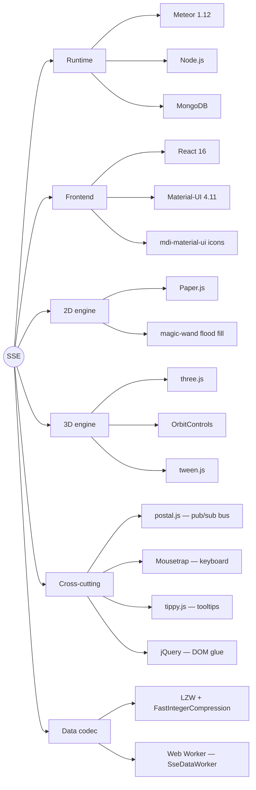

---

## 3. System overview

The browser talks to the Meteor server over two channels: **DDP** (Meteor's
reactive websocket protocol — methods + publications) and **plain HTTP**
(static file serving, binary label upload, REST export API).

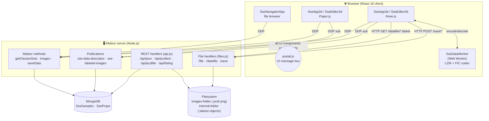

**Key idea:** 2D annotations live in **MongoDB**; 3D annotations live as **binary
files on disk** (only lightweight metadata, including the chosen label set, is
mirrored to MongoDB).

---

## 4. Repository layout

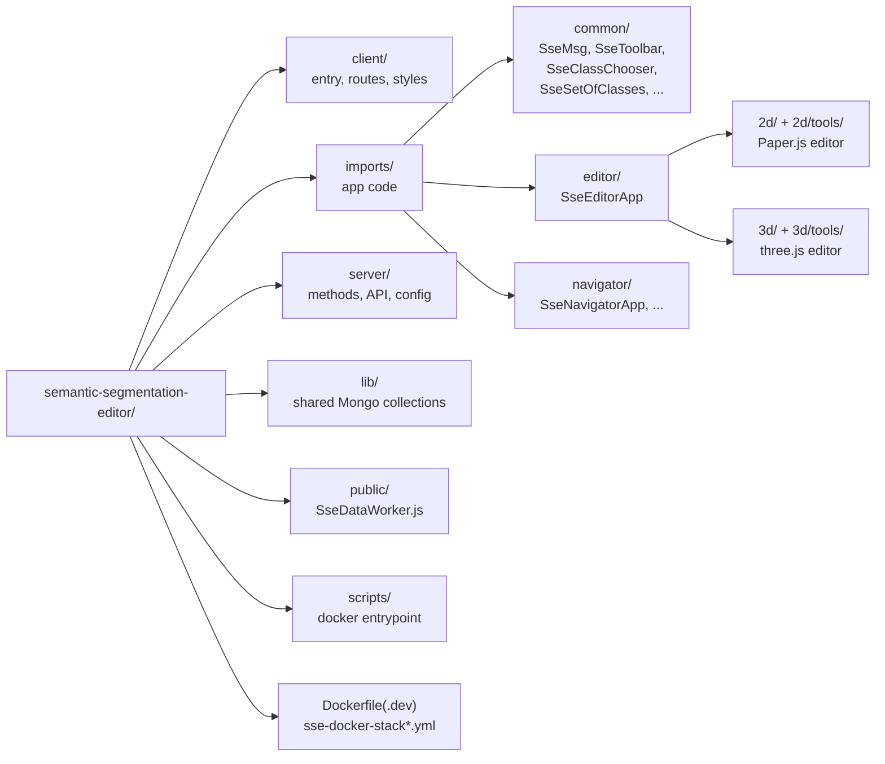

| Path | Responsibility |
|------|----------------|
| `client/main.js` / `main.html` | Client entry point; mounts `renderRoutes()` |
| `client/routes.jsx` | React Router route table |
| `client/main.less`, `layout.css`, `tippy.css` | Styling |
| `lib/collections.js` | Defines `SseSamples`, `SseProps`; declares publications |
| `server/main.js` | Meteor methods: `getClassesSets`, `images`, `saveData` |
| `server/api.js` | REST export endpoints |
| `server/files.js` | Static file serving + binary label upload (`/save`) |
| `server/config.js` | Parses `Meteor.settings` into resolved paths + class map |
| `server/SseDataWorkerServer.js` | Server-side LZW + integer (de)compression |
| `public/SseDataWorker.js` | Client Web Worker: same codec, runs off-thread |
| `imports/common/` | Shared infra: message bus, toolbar base, class chooser |
| `imports/editor/2d/` | Paper.js polygon editor + tools |
| `imports/editor/3d/` | three.js point-cloud editor + selectors |
| `imports/navigator/` | File browser & "all annotated" views |

---

## 5. Routing

`client/routes.jsx` uses React Router with a browser history. The editor picks 2D
vs 3D purely from the file extension.

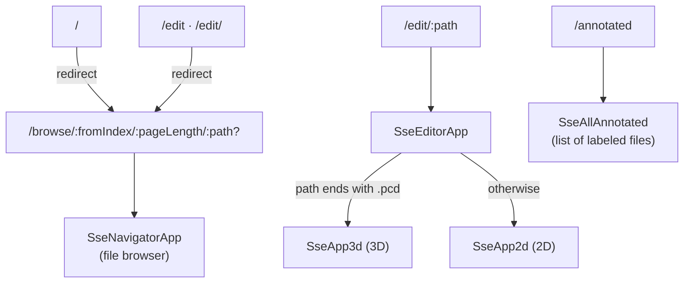

`SseEditorApp` subscribes to the `sse-data-descriptor` publication for the current
file and **renders nothing until the subscription is ready** (`subReady`). This
guarantees that when a child editor mounts, its MongoDB descriptor is already
available locally.

```js
// imports/editor/SseEditorApp.jsx (withTracker)
const imageUrl = "/" + props.match.params.path;
const subscription = Meteor.subscribe("sse-data-descriptor", imageUrl);
const subReady = subscription.ready();
const mode = props.match.params.path.endsWith(".pcd") ? "3d" : "2d";
```

---

## 6. Component tree

Both app shells (`SseApp2d`, `SseApp3d`) wrap their editor in a Material-UI theme
provider and surround it with toolbars, the class chooser, and status bars.

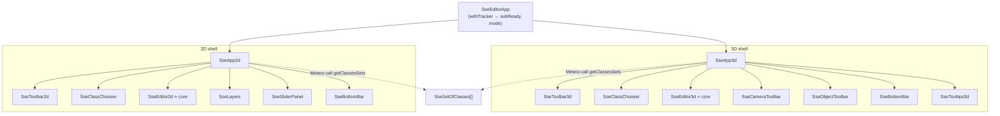

Most interactive components extend **`SseToolbar`**, which in its constructor calls
`SseMsg.register(this)` and wires Mousetrap keyboard shortcuts and tippy tooltips.
That is how a button click anywhere becomes a message on the shared bus.

---

## 7. The messaging bus (SseMsg / postal.js)

Components do **not** call each other directly. They publish/subscribe named
messages on a single postal.js channel (`ui` / topic `msg`). `SseMsg.register(obj)`
decorates any object with `sendMsg`, `onMsg`, `forgetMsg`, and `retriggerMsg`.

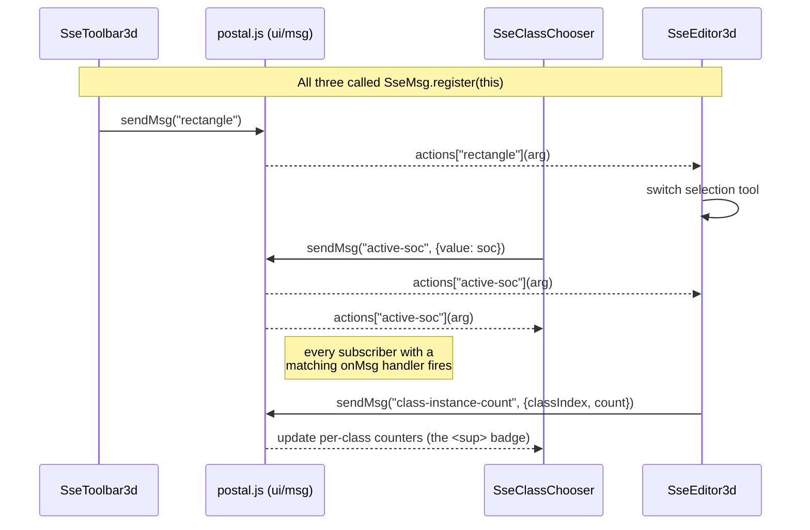

Useful details:

- **Synchronous dispatch.** `postal.publish` invokes subscribers inline, so
  `setState` calls triggered inside an `onMsg` handler are batched together with
  the originating React event handler.
- **`retriggerMsg(key)`** replays the *last* message of a given name — handy for a
  late-mounting component that needs the current state (e.g. re-applying the active
  set of classes). `SseMsg` keeps a static `lastMessages` map for this.
- **Unregister on unmount** with `SseMsg.unregister(this)` to avoid leaks.

A non-exhaustive map of the busiest 3D messages:

| Message | Sender → Receiver | Meaning |
|---------|-------------------|---------|
| `editor-ready` | Editor → ClassChooser | editor mounted; carries persisted `socName` (or none) |
| `active-soc` | ClassChooser → Editor | the active set of classes changed |
| `classSelection` / `classIndex-select` | either → both | active class index changed |
| `class-instance-count` | Editor → ClassChooser | point count per class (sidebar badges) |
| `rectangle` / `circle` / `selector` | Toolbar → Editor | switch selection tool |
| `selection-changed` | Editor → toolbars | selection set updated |
| `object-new` / `object-select` / `object-delete` | Toolbar ↔ Editor | object (instance) lifecycle |
| `rgb-toggle` / `point-size` / `color-boost` | Toolbar → Editor | rendering options |

---

## 8. Sets of classes

A **set of classes** (SOC) is a named list of label descriptors. `getClassesSets`
(server) reads them from `settings.json` and auto-assigns colors (via
`color-scheme`) to any descriptor missing one. On the client each raw config is
wrapped in an **`SseSetOfClasses`** instance providing index ↔ label ↔ color lookups.

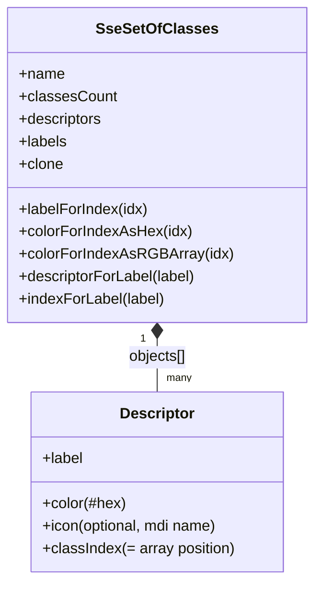

The **`classIndex` is simply the position** of a descriptor in the set's `objects`
array. By convention **index 0 is the background/void class**. This is why the
`Delete`/`D` shortcut in the 3D editor assigns class `0` to the selection — it
"erases" points back to background.

---

## 9. Data model & persistence

Two collections (`lib/collections.js`), shared client+server:

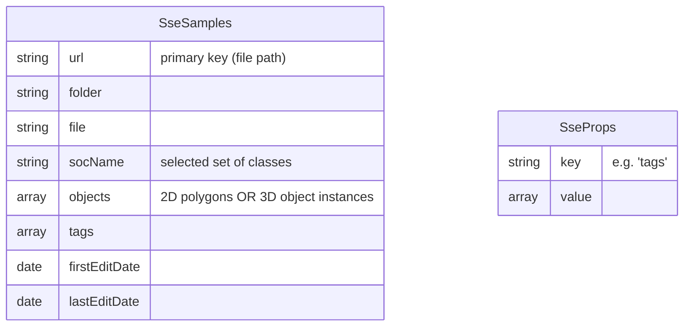

The **persistence path differs by editor type**:

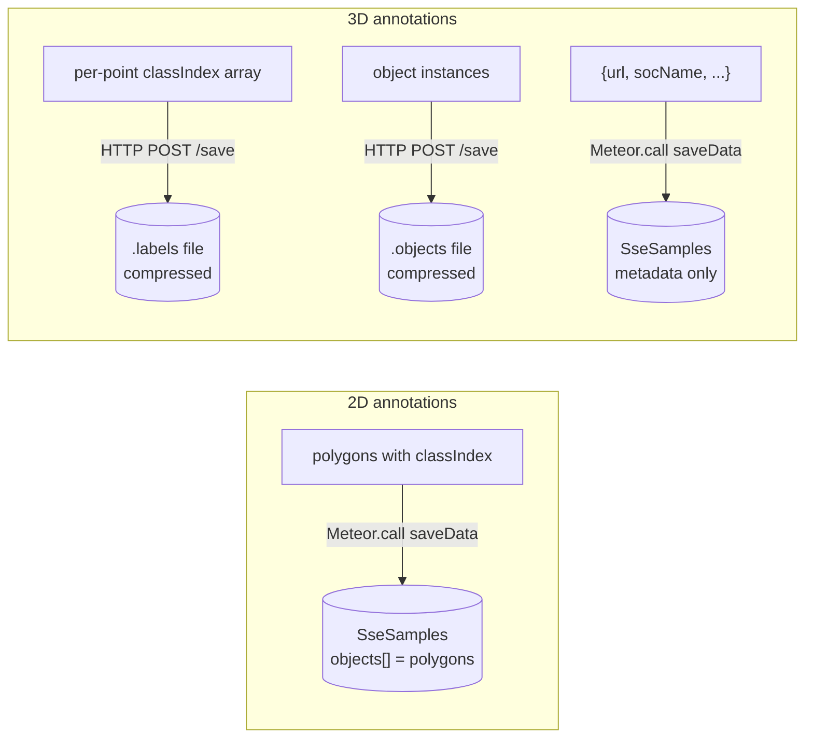

- **2D** stores the actual polygon geometry inside the Mongo document
  (`objects[].polygon`, `classIndex`, `layer`).
- **3D** keeps only **metadata** in Mongo (notably `socName`, so a reload restores
  the chosen label set). The heavy per-point data lives in two binary files in the
  *internal-folder*: `*.pcd.labels` (one class index per point) and `*.pcd.objects`
  (instance grouping).

---

## 10. 3D editor lifecycle

This is the flow that drives "open a cloud → choose a label set → annotate →
persist", including the mandatory first-time set chooser.

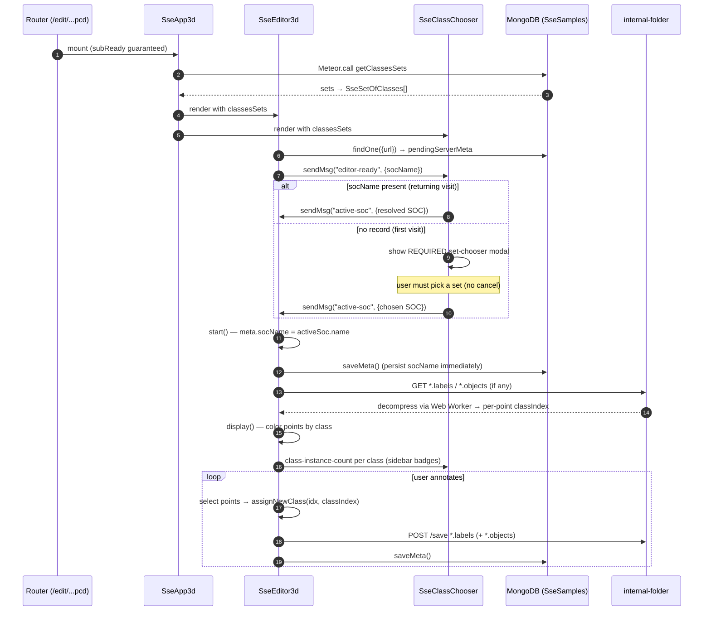

State machine for the class chooser modal:

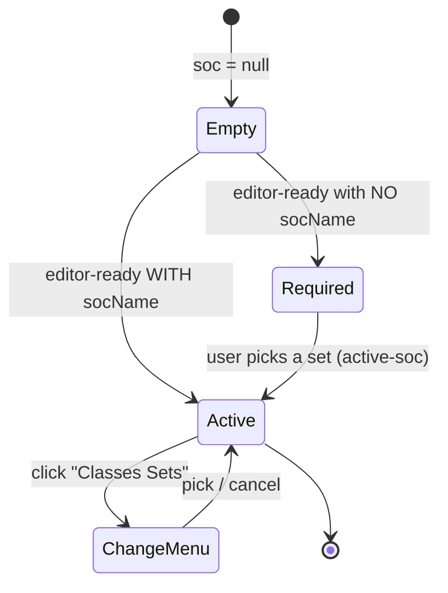

> The `display()` method always assigns `classIndex` to every point *before*
> building the color buffer, regardless of the RGB display toggle. This is load-
> bearing: `updateClassFilter()` reads `classesData[pt.classIndex].visible`, so a
> missing `classIndex` would crash. See [`CHANGES.md`](./CHANGES.md).

---

## 11. PCD format & the binary label pipeline

### PCD parsing

`SsePCDLoader` is a trimmed three.js `PCDLoader` (ASCII only) that extracts header
fields (`FIELDS x y z rgb label object`), positions, optional `rgb`, labels, and
object ids.

### Why a Web Worker

A 1-million-point cloud's label array is large. Compression/decompression runs in
**`public/SseDataWorker.js`** (a Web Worker) so the UI thread never blocks. The
identical codec also exists server-side in `SseDataWorkerServer.js` for the export
API.

```mermaid
flowchart TD
    subgraph Save["Save .labels (client → disk)"]
        A["cloudData[].classIndex<br/>(int array)"] --> B["SseDataWorker<br/>LZW string encode"]
        B --> C["FastIntegerCompression<br/>variable-byte ints"]
        C --> D["ArrayBuffer"]
        D -->|"POST /save/<path>.labels<br/>(application/octet-stream)"| E[(".labels file")]
    end

    subgraph Load["Load .labels (disk → client)"]
        F[(".labels file")] -->|"GET /datafile/<path>.labels"| G["ArrayBuffer"]
        G --> H["FIC decompress"]
        H --> I["LZW decode"]
        I --> J["int array → per-point classIndex"]
    end
```

The codec is two stages:

1. **LZW** — dictionary string compression (`SseDataManager.LZW`).
2. **FastIntegerCompression (FIC)** — variable-length byte encoding of the LZW code
   stream (1–5 bytes per integer depending on magnitude).

`server/files.js` writes uploaded buffers with `createWriteStream`. It uses
`path.join` (avoids double-slashes) and an `wstream.on('error', …)` handler so a
filesystem `EPERM` returns HTTP 500 instead of crashing the Node process.

---

## 12. 2D editor flow

The 2D editor draws polygons on a Paper.js canvas. Each tool (`SsePolygonTool`,
`SseFloodTool` / magic wand, `SseCutTool`, `SseRectangleTool`, `SsePointerTool`)
extends `SseTool` and receives mouse/keyboard callbacks.

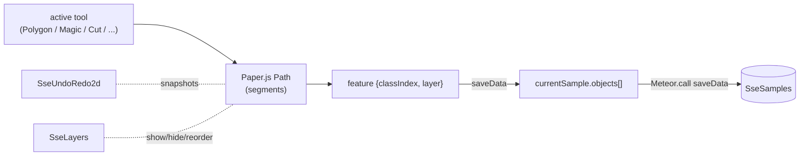

On `saveData`, each path is serialized to a `{classIndex, layer, polygon:[[x,y]…]}`
object and the whole `currentSample` is upserted into `SseSamples` via the
`saveData` Meteor method.

---

## 13. Server methods & REST API

### Meteor methods (`server/main.js`)

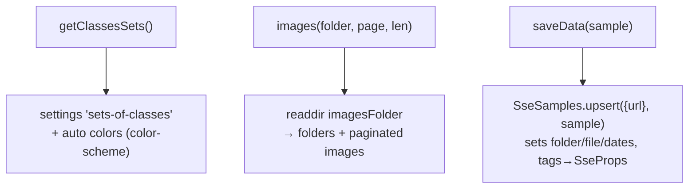

| Method | Purpose |
|--------|---------|
| `getClassesSets()` | Returns all label sets with colors filled in |
| `images(folder, pageIndex, pageLength)` | Paginated directory listing for the navigator |
| `saveData(sample)` | Upsert a sample doc (2D polygons *or* 3D metadata) |

### REST API (`server/api.js`, mounted via `WebApp.connectHandlers`)

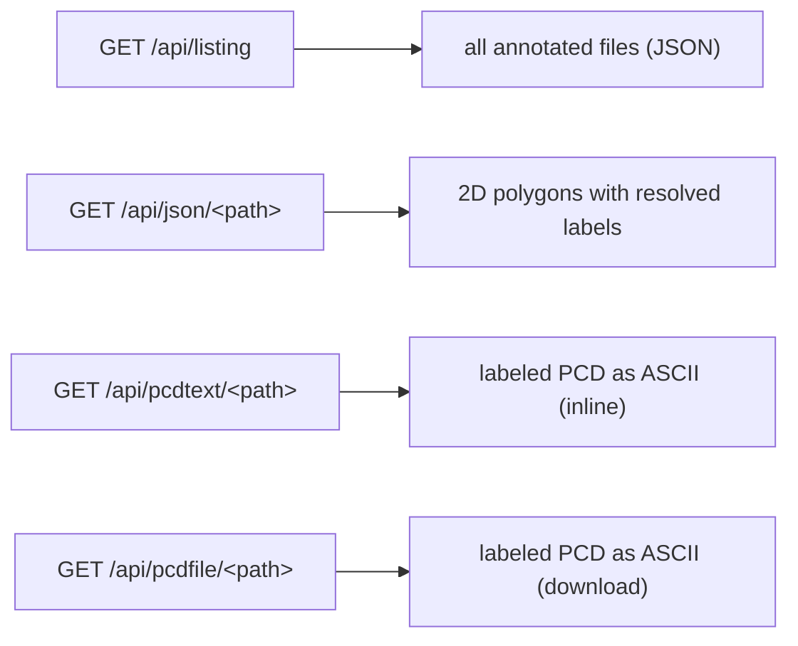

`/api/pcdtext` and `/api/pcdfile` re-merge the original `.pcd`, the decompressed
`.labels`, and the `.objects` grouping into a single ASCII PCD with
`FIELDS x y z [rgb] label object`. `/api/json` resolves each polygon's `classIndex`
to its human label using the sample's `socName` (with null-safety if the set or
index is missing).

---

## 14. Configuration

`settings.json` (or an alternate like `room_labels_new.json`) drives everything.
`server/config.js` resolves it once at startup.

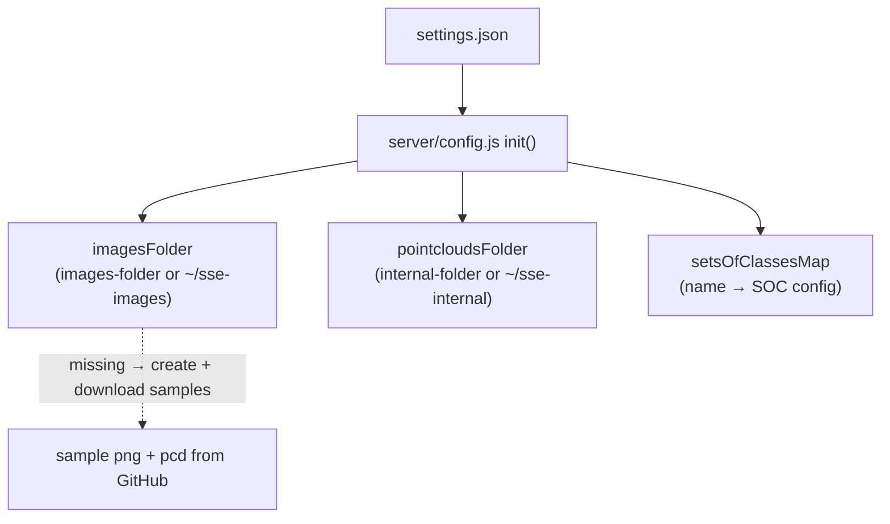

| Key | Meaning | Default |
|-----|---------|---------|
| `configuration.images-folder` | Root folder served to the navigator | `$HOME/sse-images` |
| `configuration.internal-folder` | Where `.labels` / `.objects` are stored | `$HOME/sse-internal` |
| `configuration.demo-mode` | If true, `saveData` and `/save` are no-ops | — |
| `sets-of-classes` | Array of named label sets (`label` required; `color`, `icon` optional) | built-in "33 Classes" |

---

## 15. Docker architecture

Two compose stacks share one image family.

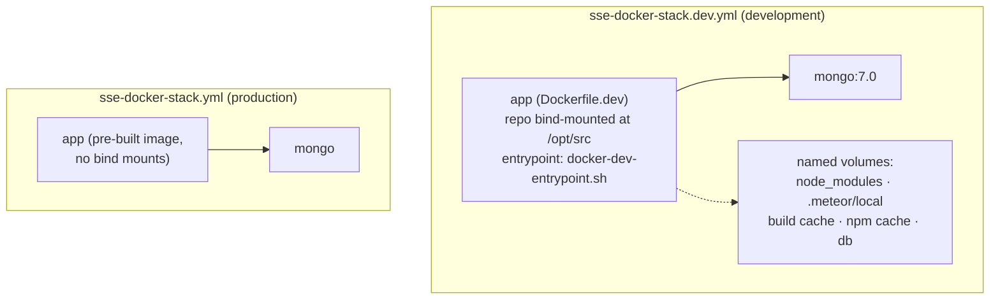

### Dev entrypoint build logic

The entrypoint **content-fingerprints the source** and skips `meteor build` when
nothing changed, and **stashes the server bundle's `node_modules` by
`npm-shrinkwrap.json` hash** so a rebuild restores them via hardlinks (seconds)
instead of reinstalling (~10 min).

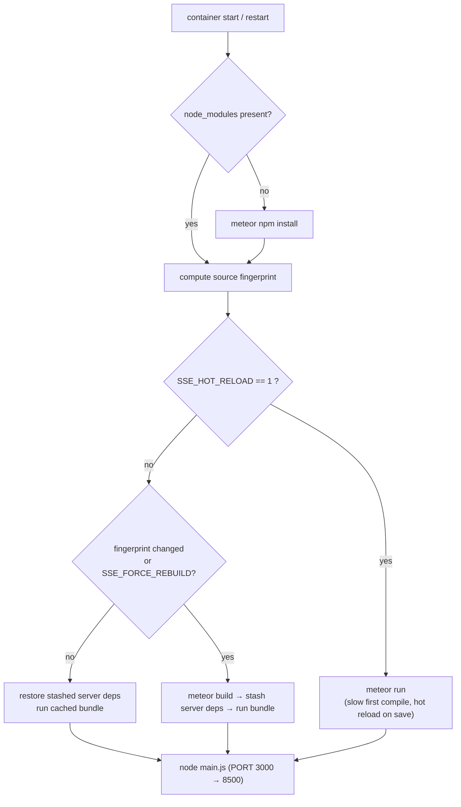

Named volumes keep `node_modules` and `.meteor/local` **Linux-native**, which
matters on macOS / Apple Silicon where the image runs under amd64 emulation. Build
logs live at `/var/cache/borovets-sse-meteor-build/meteor-build.log` inside the
container.

| Command | Effect |
|---------|--------|
| `docker compose -f sse-docker-stack.dev.yml build` | Build the dev image (runs `meteor npm install`) |
| `… up` | Start; builds on container start |
| `… restart app` | Apply JS/JSX/Less changes (build only if sources changed) |
| `SSE_FORCE_REBUILD=1 … restart app` | Force full rebuild + server npm install |
| `SSE_HOT_RELOAD=1 … up` | Classic hot reload on save |
| `… down` / `down -v` | Stop (keep volumes) / wipe all caches & data |

---

*Diagrams are written in [Mermaid](https://mermaid.js.org/) and render natively on
GitHub and in most Markdown viewers.*
