# Semantic Segmentation Editor — Архитектура

> Подробный справочник для разработчиков, работающих с этой кодовой базой. Команды
> запуска см. в [`CLAUDE.md`](../CLAUDE.md); журнал последних изменений — в
> [`CHANGES.md`](./CHANGES.md); рабочий процесс Docker-разработки — в
> [`DOCKER_DEV.md`](./DOCKER_DEV.md). Английская версия —
> [`ARCHITECTURE.md`](./ARCHITECTURE.md).

---

## Содержание

1. [Что это](#1-что-это)
2. [Технологический стек](#2-технологический-стек)
3. [Обзор системы](#3-обзор-системы)
4. [Структура репозитория](#4-структура-репозитория)
5. [Маршрутизация](#5-маршрутизация)
6. [Дерево компонентов](#6-дерево-компонентов)
7. [Шина сообщений (SseMsg / postal.js)](#7-шина-сообщений-ssemsg--postaljs)
8. [Наборы классов](#8-наборы-классов)
9. [Модель данных и хранение](#9-модель-данных-и-хранение)
10. [Жизненный цикл 3D-редактора](#10-жизненный-цикл-3d-редактора)
11. [Формат PCD и конвейер бинарных меток](#11-формат-pcd-и-конвейер-бинарных-меток)
12. [Поток 2D-редактора](#12-поток-2d-редактора)
13. [Серверные методы и REST API](#13-серверные-методы-и-rest-api)
14. [Конфигурация](#14-конфигурация)
15. [Архитектура Docker](#15-архитектура-docker)

---

## 1. Что это

Веб-приложение на **Meteor 1.12 + React 16** для разметки **2D-изображений**
(PNG/JPG/BMP) и **3D-облаков точек** (PCD) с целью создания обучающих датасетов для
ИИ. Изначально разработано Hitachi Automotive & Industry Lab для исследований в
области беспилотного вождения.

Один общий каркас содержит два редактора:

- **2D-редактор** — рисование полигонов поверх растрового изображения средствами
  **Paper.js**.
- **3D-редактор** — отрисовка облака точек и инструменты выделения на **three.js**.

Приложение работает по адресу `http://localhost:3000` (нативный Meteor) или
`http://localhost:8500` (Docker dev).

---

## 2. Технологический стек

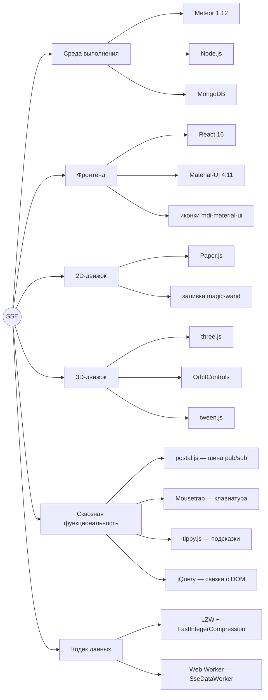

---

## 3. Обзор системы

Браузер общается с сервером Meteor по двум каналам: **DDP** (реактивный
websocket-протокол Meteor — методы и публикации) и **обычный HTTP** (раздача
статики, загрузка бинарных меток, REST API для экспорта).

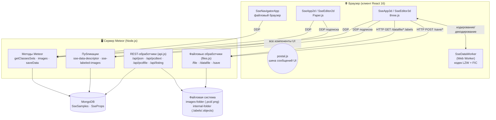

**Ключевая идея:** 2D-разметка хранится в **MongoDB**; 3D-разметка хранится как
**бинарные файлы на диске** (в MongoDB зеркалируются только лёгкие метаданные,
включая выбранный набор классов).

---

## 4. Структура репозитория

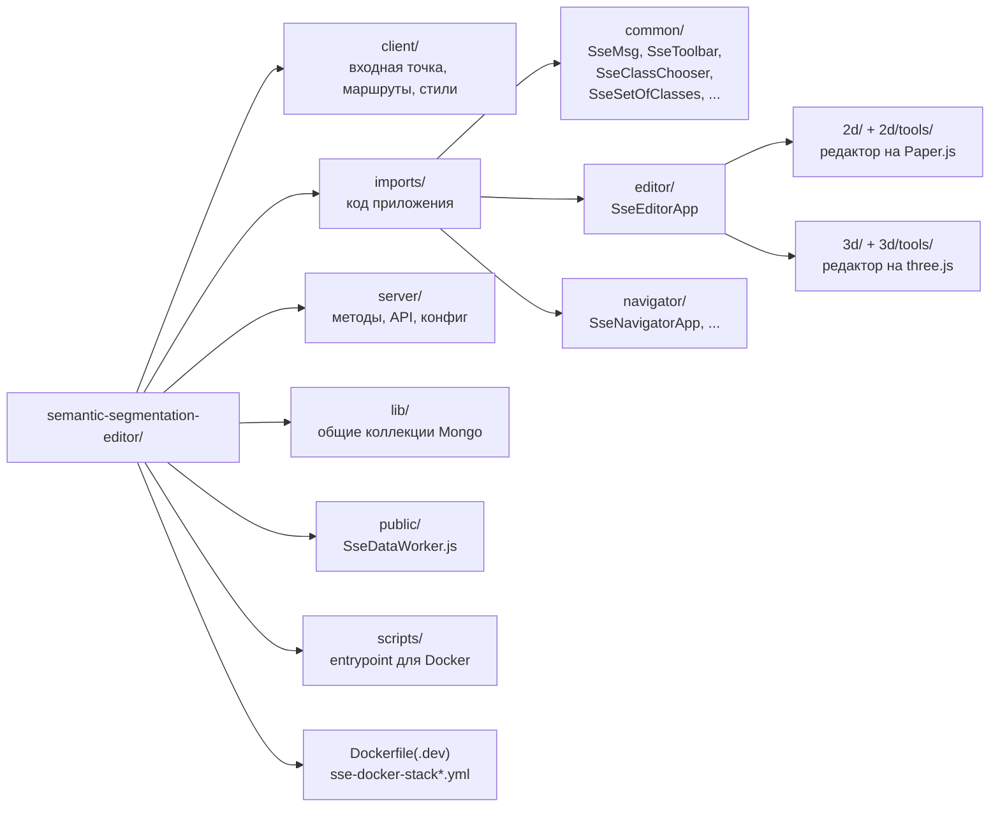

| Путь | Назначение |
|------|------------|
| `client/main.js` / `main.html` | Входная точка клиента; монтирует `renderRoutes()` |
| `client/routes.jsx` | Таблица маршрутов React Router |
| `client/main.less`, `layout.css`, `tippy.css` | Стили |
| `lib/collections.js` | Определяет `SseSamples`, `SseProps`; объявляет публикации |
| `server/main.js` | Методы Meteor: `getClassesSets`, `images`, `saveData` |
| `server/api.js` | REST-эндпоинты экспорта |
| `server/files.js` | Раздача статики + загрузка бинарных меток (`/save`) |
| `server/config.js` | Разбирает `Meteor.settings` в готовые пути + карту классов |
| `server/SseDataWorkerServer.js` | Серверное LZW + целочисленное (де)сжатие |
| `public/SseDataWorker.js` | Клиентский Web Worker: тот же кодек, в отдельном потоке |
| `imports/common/` | Общая инфраструктура: шина сообщений, базовый тулбар, выбор классов |
| `imports/editor/2d/` | Полигональный редактор на Paper.js + инструменты |
| `imports/editor/3d/` | Редактор облаков точек на three.js + селекторы |
| `imports/navigator/` | Файловый браузер и список «всё размеченное» |

---

## 5. Маршрутизация

`client/routes.jsx` использует React Router с browser history. Редактор выбирает 2D
или 3D исключительно по расширению файла.

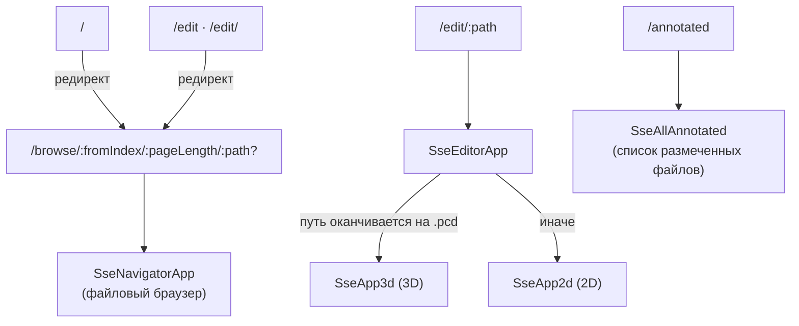

`SseEditorApp` подписывается на публикацию `sse-data-descriptor` для текущего файла
и **ничего не рендерит, пока подписка не готова** (`subReady`). Это гарантирует, что
к моменту монтирования дочернего редактора его дескриптор из MongoDB уже доступен
локально.

```js
// imports/editor/SseEditorApp.jsx (withTracker)
const imageUrl = "/" + props.match.params.path;
const subscription = Meteor.subscribe("sse-data-descriptor", imageUrl);
const subReady = subscription.ready();
const mode = props.match.params.path.endsWith(".pcd") ? "3d" : "2d";
```

---

## 6. Дерево компонентов

Оба каркаса (`SseApp2d`, `SseApp3d`) оборачивают свой редактор в провайдер темы
Material-UI и окружают его тулбарами, выбором классов и статус-барами.

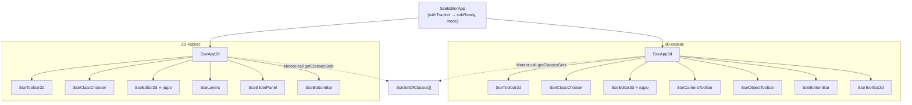

Большинство интерактивных компонентов наследуются от **`SseToolbar`**, который в
конструкторе вызывает `SseMsg.register(this)` и подключает горячие клавиши
(Mousetrap) и подсказки (tippy). Именно так клик по любой кнопке превращается в
сообщение на общей шине.

---

## 7. Шина сообщений (SseMsg / postal.js)

Компоненты **не** вызывают друг друга напрямую. Они публикуют/подписываются на
именованные сообщения в одном канале postal.js (`ui` / топик `msg`).
`SseMsg.register(obj)` добавляет любому объекту методы `sendMsg`, `onMsg`,
`forgetMsg` и `retriggerMsg`.

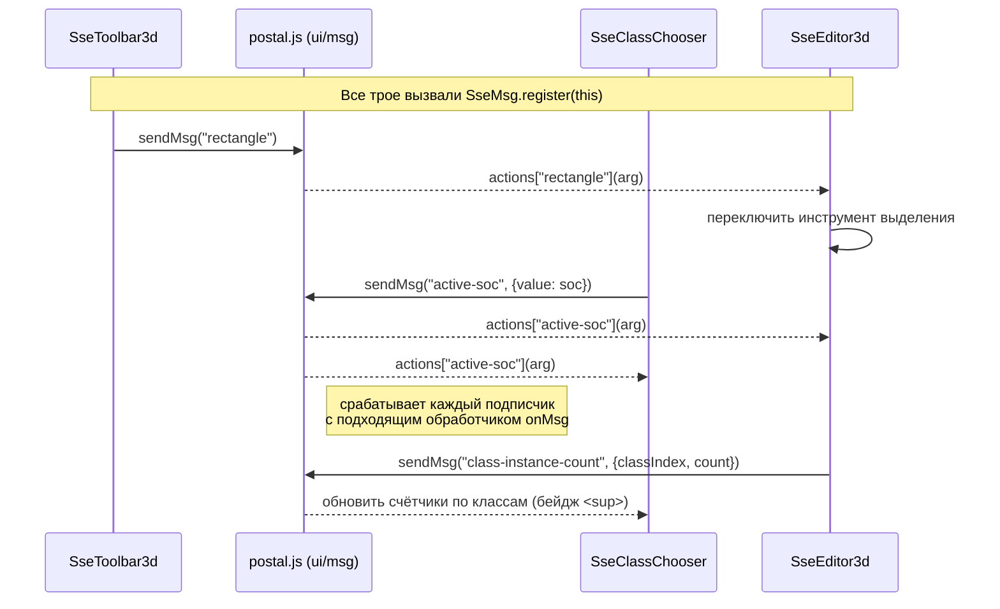

Полезные детали:

- **Синхронная доставка.** `postal.publish` вызывает подписчиков немедленно,
  поэтому вызовы `setState` внутри обработчика `onMsg` батчатся вместе с исходным
  обработчиком события React.
- **`retriggerMsg(key)`** повторно проигрывает *последнее* сообщение с данным именем
  — удобно для компонента, смонтированного позже, которому нужно текущее состояние
  (например, повторно применить активный набор классов). `SseMsg` хранит для этого
  статическую карту `lastMessages`.
- **Отписывайтесь при размонтировании** через `SseMsg.unregister(this)`, чтобы
  избежать утечек.

Неполная карта самых активных 3D-сообщений:

| Сообщение | Отправитель → Получатель | Смысл |
|-----------|--------------------------|-------|
| `editor-ready` | Editor → ClassChooser | редактор смонтирован; несёт сохранённый `socName` (или его нет) |
| `active-soc` | ClassChooser → Editor | сменился активный набор классов |
| `classSelection` / `classIndex-select` | оба → оба | сменился индекс активного класса |
| `class-instance-count` | Editor → ClassChooser | число точек по классу (бейджи в сайдбаре) |
| `rectangle` / `circle` / `selector` | Toolbar → Editor | переключить инструмент выделения |
| `selection-changed` | Editor → тулбары | изменилось множество выделения |
| `object-new` / `object-select` / `object-delete` | Toolbar ↔ Editor | жизненный цикл объекта (экземпляра) |
| `rgb-toggle` / `point-size` / `color-boost` | Toolbar → Editor | параметры отрисовки |

---

## 8. Наборы классов

**Набор классов** (set of classes, SOC) — это именованный список дескрипторов
меток. `getClassesSets` (сервер) читает их из `settings.json` и автоматически
назначает цвета (через `color-scheme`) тем дескрипторам, у которых цвет не указан.
На клиенте каждая «сырая» конфигурация оборачивается в экземпляр
**`SseSetOfClasses`**, предоставляющий преобразования индекс ↔ метка ↔ цвет.

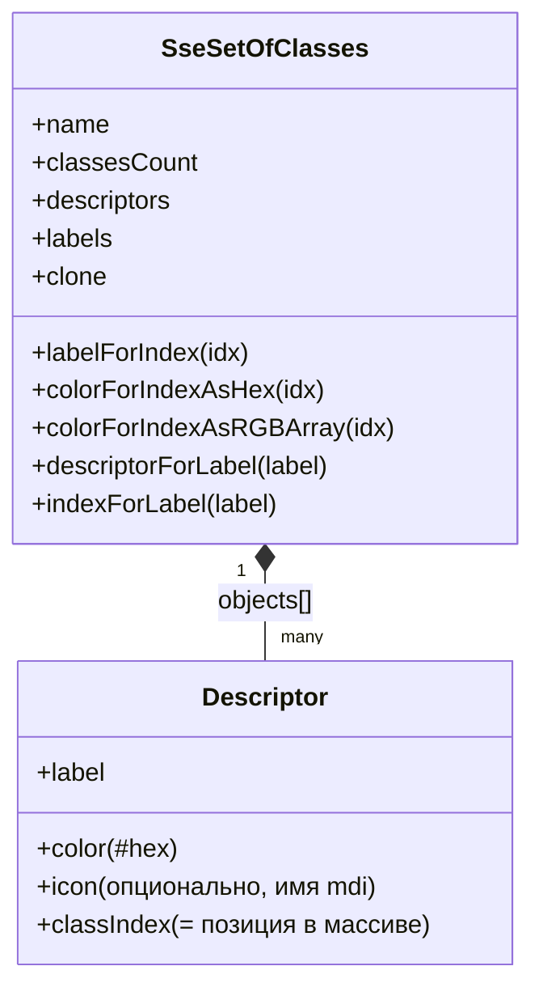

**`classIndex` — это просто позиция** дескриптора в массиве `objects` набора. По
соглашению **индекс 0 — это фоновый/пустой класс (background/void)**. Именно поэтому
горячая клавиша `Delete`/`D` в 3D-редакторе присваивает выделению класс `0` — она
«стирает» точки обратно в фон.

---

## 9. Модель данных и хранение

Две коллекции (`lib/collections.js`), общие для клиента и сервера:

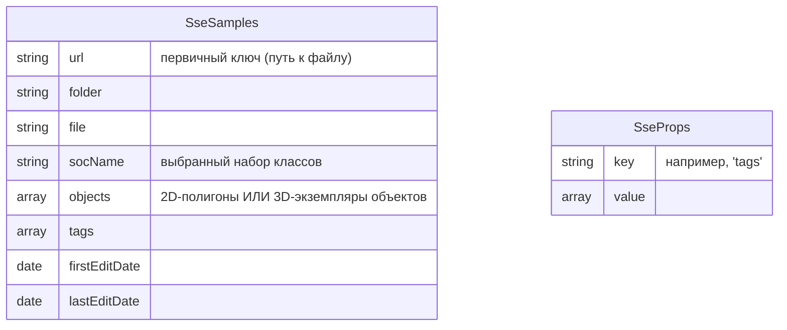

**Путь хранения различается по типу редактора:**

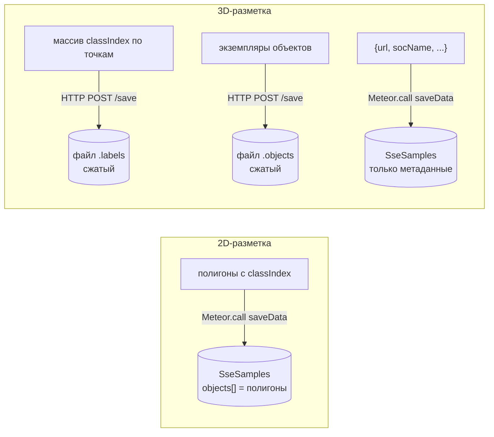

- **2D** хранит саму геометрию полигонов внутри документа Mongo
  (`objects[].polygon`, `classIndex`, `layer`).
- **3D** держит в Mongo только **метаданные** (прежде всего `socName`, чтобы при
  перезагрузке восстановить выбранный набор классов). Тяжёлые данные по точкам лежат
  в двух бинарных файлах в *internal-folder*: `*.pcd.labels` (один индекс класса на
  точку) и `*.pcd.objects` (группировка по экземплярам).

---

## 10. Жизненный цикл 3D-редактора

Это поток, который реализует «открыть облако → выбрать набор классов → размечать →
сохранять», включая обязательный выбор набора при первом открытии.

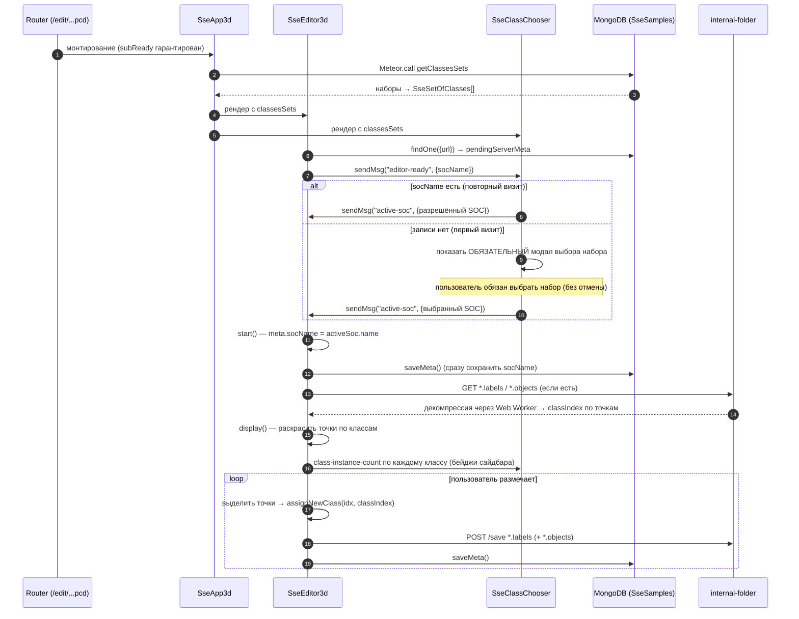

Машина состояний модала выбора классов:

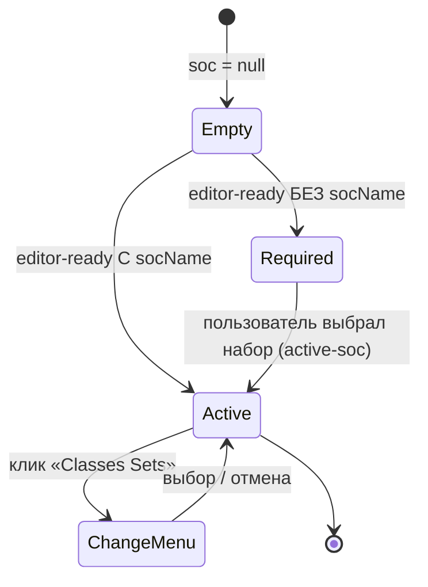

> Метод `display()` всегда присваивает `classIndex` каждой точке *до* построения
> буфера цвета, независимо от переключателя отображения RGB. Это критично:
> `updateClassFilter()` читает `classesData[pt.classIndex].visible`, поэтому
> отсутствующий `classIndex` приведёт к падению. См. [`CHANGES.md`](./CHANGES.md).

---

## 11. Формат PCD и конвейер бинарных меток

### Разбор PCD

`SsePCDLoader` — это урезанный `PCDLoader` из three.js (только ASCII PCD), который
извлекает поля заголовка (`FIELDS x y z rgb label object`), позиции, опциональный
`rgb`, метки и идентификаторы объектов.

### Зачем Web Worker

Массив меток для облака из миллиона точек большой. Сжатие/декомпрессия выполняются в
**`public/SseDataWorker.js`** (Web Worker), чтобы UI-поток никогда не блокировался.
Идентичный кодек существует и на сервере в `SseDataWorkerServer.js` для API
экспорта.

```mermaid
flowchart TD
    subgraph Save["Сохранение .labels (клиент → диск)"]
        A["cloudData[].classIndex<br/>(массив int)"] --> B["SseDataWorker<br/>строковое кодирование LZW"]
        B --> C["FastIntegerCompression<br/>целые переменной длины"]
        C --> D["ArrayBuffer"]
        D -->|"POST /save/<path>.labels<br/>(application/octet-stream)"| E[("файл .labels")]
    end

    subgraph Load["Загрузка .labels (диск → клиент)"]
        F[("файл .labels")] -->|"GET /datafile/<path>.labels"| G["ArrayBuffer"]
        G --> H["декомпрессия FIC"]
        H --> I["декодирование LZW"]
        I --> J["массив int → classIndex по точкам"]
    end
```

Кодек состоит из двух стадий:

1. **LZW** — словарное сжатие строк (`SseDataManager.LZW`).
2. **FastIntegerCompression (FIC)** — кодирование потока кодов LZW целыми переменной
   длины (1–5 байт на целое в зависимости от величины).

`server/files.js` записывает загруженные буферы через `createWriteStream`. Он
использует `path.join` (исключает двойные слэши) и обработчик
`wstream.on('error', …)`, чтобы ошибка файловой системы `EPERM` возвращала HTTP 500,
а не роняла процесс Node.

---

## 12. Поток 2D-редактора

2D-редактор рисует полигоны на холсте Paper.js. Каждый инструмент
(`SsePolygonTool`, `SseFloodTool` / волшебная палочка, `SseCutTool`,
`SseRectangleTool`, `SsePointerTool`) наследуется от `SseTool` и получает
обработчики мыши/клавиатуры.

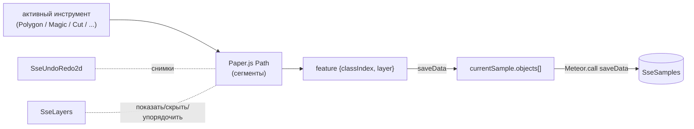

При `saveData` каждый путь сериализуется в объект
`{classIndex, layer, polygon:[[x,y]…]}`, и весь `currentSample` записывается
(upsert) в `SseSamples` через метод `saveData`.

---

## 13. Серверные методы и REST API

### Методы Meteor (`server/main.js`)

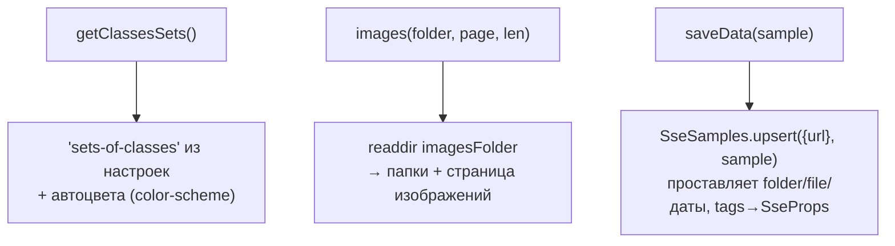

| Метод | Назначение |
|-------|------------|
| `getClassesSets()` | Возвращает все наборы меток с заполненными цветами |
| `images(folder, pageIndex, pageLength)` | Постраничный листинг директории для навигатора |
| `saveData(sample)` | Upsert документа-образца (2D-полигоны *или* 3D-метаданные) |

### REST API (`server/api.js`, монтируется через `WebApp.connectHandlers`)

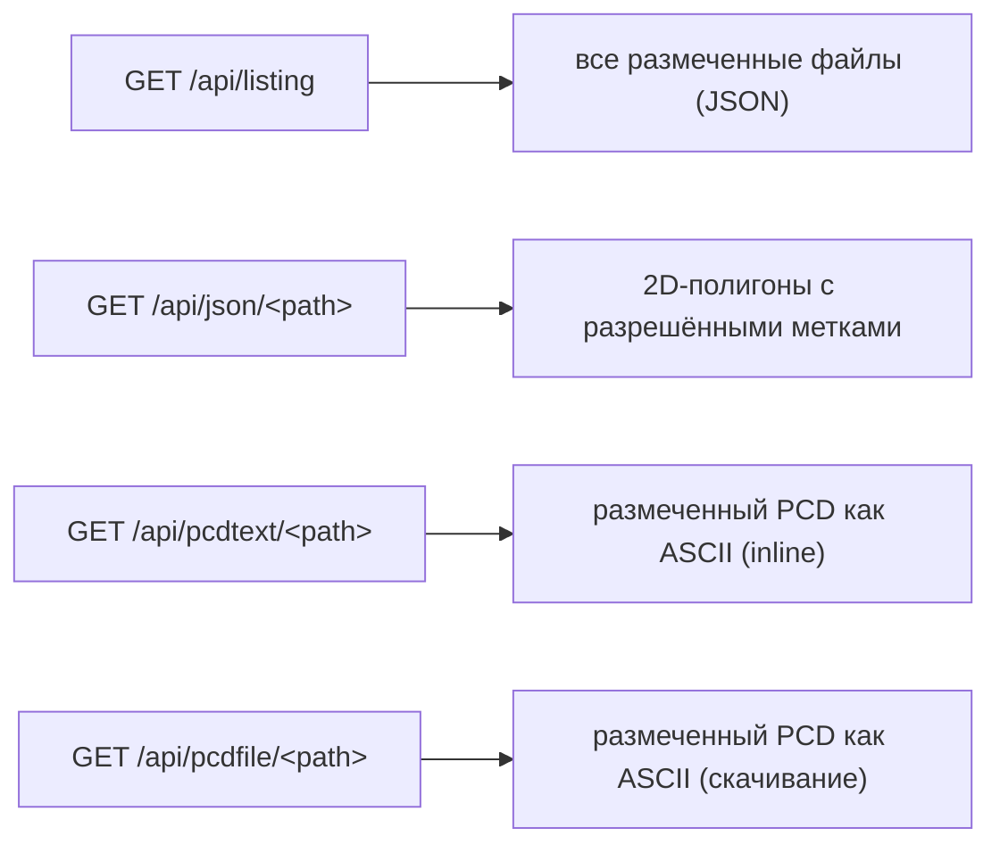

`/api/pcdtext` и `/api/pcdfile` заново склеивают исходный `.pcd`, распакованный
`.labels` и группировку `.objects` в единый ASCII PCD с полями
`FIELDS x y z [rgb] label object`. `/api/json` разрешает `classIndex` каждого
полигона в человекочитаемую метку, используя `socName` образца (с защитой от
отсутствующего набора или индекса).

---

## 14. Конфигурация

`settings.json` (или альтернативный файл вроде `room_labels_new.json`) управляет
всем. `server/config.js` разбирает его один раз при старте.

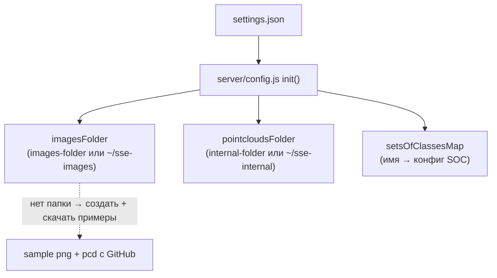

| Ключ | Смысл | По умолчанию |
|------|-------|--------------|
| `configuration.images-folder` | Корневая папка, отдаваемая навигатору | `$HOME/sse-images` |
| `configuration.internal-folder` | Где хранятся `.labels` / `.objects` | `$HOME/sse-internal` |
| `configuration.demo-mode` | Если true, `saveData` и `/save` ничего не делают | — |
| `sets-of-classes` | Массив именованных наборов меток (`label` обязателен; `color`, `icon` опциональны) | встроенный «33 Classes» |

---

## 15. Архитектура Docker

Два compose-стека используют одно семейство образов.

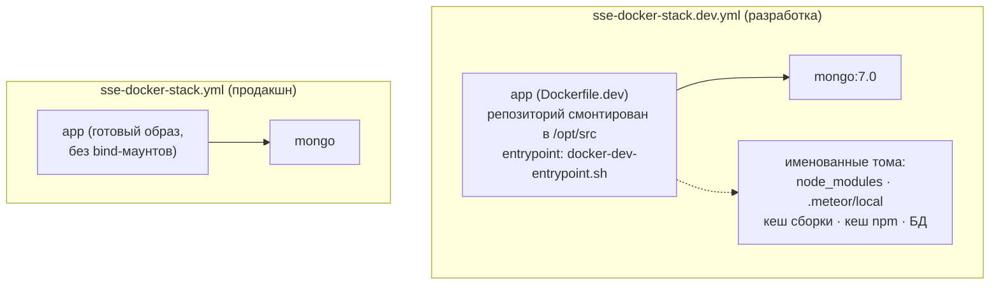

### Логика сборки dev-entrypoint

Entrypoint **снимает контентный отпечаток исходников** и пропускает `meteor build`,
когда ничего не изменилось, а также **складывает `node_modules` серверного бандла по
хешу `npm-shrinkwrap.json`**, чтобы при пересборке восстановить их через хардлинки
(секунды) вместо переустановки (~10 мин).

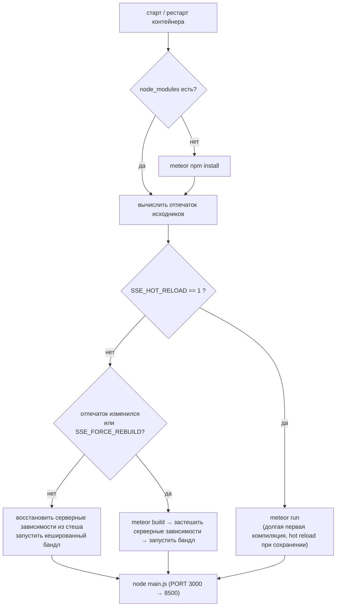

Именованные тома держат `node_modules` и `.meteor/local` **нативными для Linux**, что
важно на macOS / Apple Silicon, где образ запускается под эмуляцией amd64. Логи
сборки лежат в `/var/cache/borovets-sse-meteor-build/meteor-build.log` внутри
контейнера.

| Команда | Эффект |
|---------|--------|
| `docker compose -f sse-docker-stack.dev.yml build` | Собрать dev-образ (выполняет `meteor npm install`) |
| `… up` | Запуск; собирает при старте контейнера |
| `… restart app` | Применить изменения JS/JSX/Less (сборка только если исходники изменились) |
| `SSE_FORCE_REBUILD=1 … restart app` | Принудительная полная пересборка + npm install сервера |
| `SSE_HOT_RELOAD=1 … up` | Классический hot reload при сохранении |
| `… down` / `down -v` | Остановить (сохранив тома) / стереть все кеши и данные |

---

*Диаграммы написаны на [Mermaid](https://mermaid.js.org/) и нативно рендерятся на
GitHub и в большинстве просмотрщиков Markdown.*
